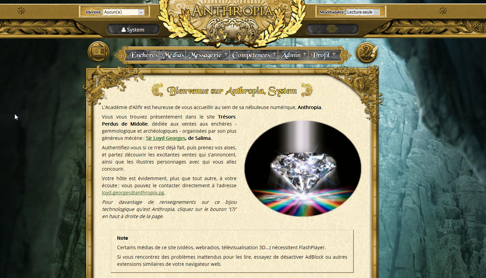
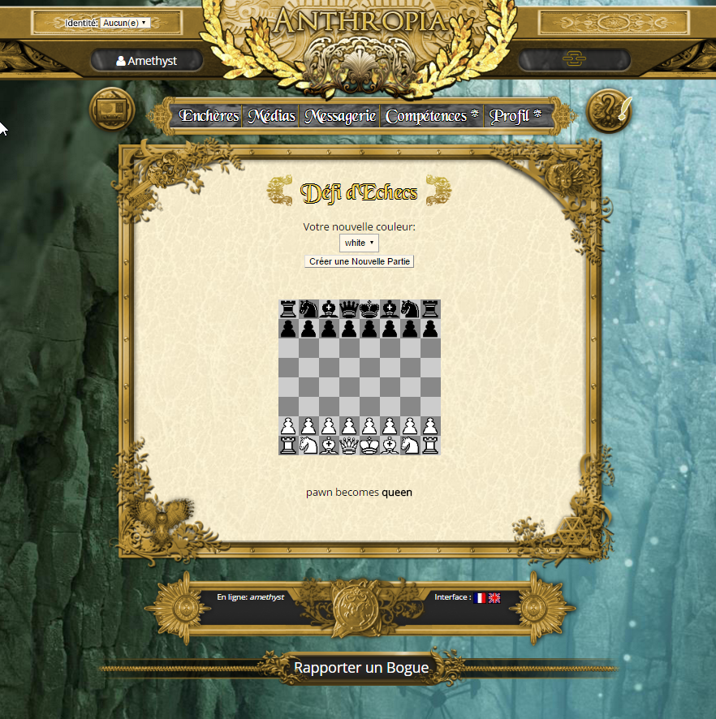

PYCHRONIA
===========

Pychronia is a portal for "alternate reality games", allowing small/medium groups of players to live great adventures together, thanks to all the communication channels and gameplays that it offers.

Features include:

- shiny and responsive-design html/css theme (Metal radiance)
- internationalized interface (English and French only for now)
- ingame user accounts, with permissions management
- chatroom, text messaging, webradio, web encyclopedia
- rich text including sounds, images and videos
- ownership of money and 2D/3D artefacts
- special abilities (spying, mercenaries, data analysis...)
- internal CMS system, allowing to create multimedia content, characters, radio spots (with Acapela text-to-speech)
- bots with artificial intelligence (AIML)
- special abilities for game masters and game observers (impersonation of users, ingame hints, full control of game data)

Technically, Pychronia is a bundle of Django framework applications, using Zodb for game data persistence.
It also contains a Django-CMS application with a blog, meant to present games created with this engine.

See the "docs/" folder for more information on installing, contributing, licenses, etc.

**Beware, python sources are available under BSD license, but embedded javascript and css libraries have licenses of their own. Also note that the included webdesign "Metal radiance" is licensed as "Creative Commons Attribution Non-Commercial 2.0". Contact us if you want to use it for a commercial project.**

Chrysalis RPG Campaign
---------------------------

A multi-styles roleplay-game campaign (texts in French only) can be found at http://chrysalis-game.com/
The media and scenarios of this campaign are available in the `dedicated chrysalis repository <https://github.com/ChrysalisTeam/chrysalis>`_.

Screenshots of the pychronia portal
----------------------------------------

    

    

    

    

    

    

    

    

    

    

    
